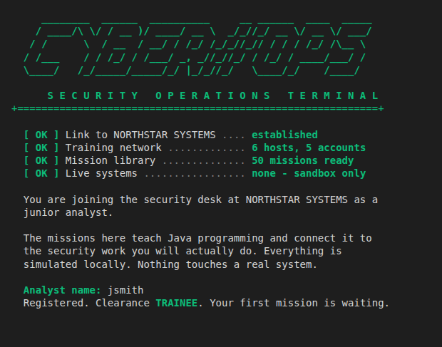
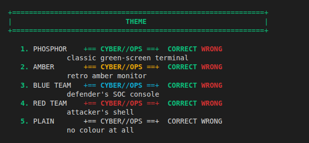
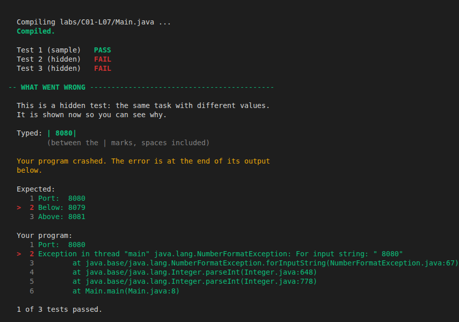

# CYBER//OPS

**Learn Java from zero, as a junior analyst on a security team.**

CYBER//OPS is a training game that runs in your terminal. You join the
security desk at NORTHSTAR SYSTEMS, a fictional company, and every mission
teaches one piece of Java, then shows where that Java is used in security
work: counting failed logins, grading vulnerabilities, parsing logs,
stopping forged log entries, checking access.

- **No experience needed.** It starts from what Java is.
- **It teaches before it asks.** Each mission explains an idea, shows a
  working example line by line, then asks you to predict, find the bug or
  write a single line of code. You never paste in a whole program.
- **It is honest.** Every example in the game is compiled and run by a real
  Java compiler before it is published, so what the game says Java prints
  is what Java prints.
- **Nothing real is touched.** Everything is simulated on your own machine.
  No network, no accounts, no attacking anything.



> **Status:** 100 missions and 70 labs are playable (Campaigns 00 to 02
> complete with their labs; Campaign 03's missions complete, its labs next)
> out of 510 missions planned. The order
> follows a first-year Java programming module; see
> [the curriculum plan](docs/CURRICULUM.md).

---

## Contents

1. [Quick start](#quick-start)
2. [Step 1: install Java](#step-1-install-java)
3. [Step 2: get the game](#step-2-get-the-game)
4. [Step 3: play](#step-3-play)
5. [How to play](#how-to-play)
6. [Labs: writing whole programs](#labs-writing-whole-programs)
7. [Updating to the newest missions](#updating-to-the-newest-missions)
8. [Troubleshooting](#troubleshooting)
9. [What is in the game](#what-is-in-the-game)
10. [For contributors](#for-contributors)
11. [Licence](#licence)

---

## Quick start

If you already have Java and Git installed:

```
git clone https://github.com/0x14117/STATIC-VOID.git
cd STATIC-VOID
```

Then on **Windows**:

```
.\play.bat
```

On **macOS or Linux**:

```
./play.sh
```

Not sure whether you have Java? Start at [Step 1](#step-1-install-java).

---

## Step 1: install Java

The game needs a **JDK** (Java Development Kit). A JDK includes `javac`, the
compiler. A JRE, or "Java for browsers", does **not** include it and is not
enough.

### Check whether you already have one

Open a terminal (on Windows: **PowerShell** or **Command Prompt**; on macOS:
**Terminal**) and type:

```
javac -version
```

If you see something like `javac 21.0.4`, you are ready. Skip to
[Step 2](#step-2-get-the-game). Any version from **8** upwards runs the game.

If you see `'javac' is not recognized` or `command not found`, install a JDK
using one of the commands below. If you are installing one now, choose
version **21**.

### Windows

In PowerShell:

```
winget install EclipseAdoptium.Temurin.21.JDK
```

Or download the installer from **https://adoptium.net**. When it asks, tick
**Set JAVA_HOME** and **Add to PATH**.

**Close the terminal and open a new one afterwards.** A terminal that was
already open will not see the new install.

### macOS

With [Homebrew](https://brew.sh):

```
brew install --cask temurin
```

Or download the installer from **https://adoptium.net**.

### Linux

Ubuntu, Debian, Mint:

```
sudo apt update
sudo apt install default-jdk
```

Fedora:

```
sudo dnf install java-21-openjdk-devel
```

Arch:

```
sudo pacman -S jdk-openjdk
```

### Confirm it worked

```
javac -version
java -version
```

Both should print a version number. Ideally it is the same version for both.

---

## Step 2: get the game

### Option A: with Git (recommended, makes updating easy)

If you do not have Git: on Windows run `winget install Git.Git`, on macOS run
`brew install git`, on Ubuntu or Debian run `sudo apt install git`.

Then:

```
git clone https://github.com/0x14117/STATIC-VOID.git
cd STATIC-VOID
```

This makes a folder called `STATIC-VOID` in whatever folder your terminal
was in. To put it somewhere specific, `cd` there first. For example, on
Windows:

```
cd D:\
git clone https://github.com/0x14117/STATIC-VOID.git
cd STATIC-VOID
```

### Option B: download a ZIP (no Git needed)

1. Download:
   **https://github.com/0x14117/STATIC-VOID/archive/refs/heads/main.zip**
2. Unzip it. You get a folder called `STATIC-VOID-main`.
3. Open a terminal in that folder. On Windows, open the folder in File
   Explorer, click the address bar, type `powershell` and press ENTER.

### Check you are in the right place

List the folder. On Windows type `dir`, on macOS or Linux type `ls`. You
should see:

```
README.md   play.bat   play.sh   src   tools
```

If `src` is missing, the download did not finish. Clone or download it
again.

---

## Step 3: play

### Windows

Either **double-click `play.bat`** in File Explorer, or run it from a
terminal inside the game folder.

PowerShell:

```
.\play.bat
```

Command Prompt:

```
play.bat
```

### macOS and Linux

From a terminal inside the game folder:

```
./play.sh
```

If that says `Permission denied`, use:

```
sh play.sh
```

### What the scripts do

Each script compiles the game into an `out` folder, then starts it. You can
do the same by hand.

macOS and Linux:

```
javac -d out src/*.java
java -cp out Main
```

Windows (PowerShell):

```
javac -d out (Get-ChildItem src\*.java).FullName
java -cp out Main
```

Compiling takes a few seconds. After that the game starts at once.

---

## How to play

### First run

You are asked for an analyst name. Then you see the **dashboard**: your
level, your clearance, and the next mission waiting for you.

### The menu

| Key | Option | What it does |
|-----|--------|--------------|
| `1` | View Mission | Read the briefing for your next mission before starting it |
| `2` | Start Mission | Play your next unfinished mission |
| `3` | Training | Replay **any** mission by typing its ID, for example `C01-M017` |
| `4` | Labs | Write whole programs in your own editor; the game compiles and tests them |
| `5` | Java Knowledge | Every Java topic, ticked as you learn it. Type a topic name to read about it |
| `6` | Campaign Map | All 20 campaigns and how far through them you are |
| `7` | Progress | XP, level, missions and labs completed, topics learned, hints used, wrong answers |
| `8` | Settings | Change your name or theme, reset progress, find your save file, see the NORTHSTAR network |
| `9` | Exit | Save and quit |

### Inside a mission

A mission walks through the same stages every time:

```
MISSION BRIEF          what is going on at NORTHSTAR
WHAT YOU WILL LEARN    the ideas in this mission
JAVA CONCEPT           the explanation
SMALL EXAMPLE          a working program and what it prints
LINE BY LINE           the important lines, one at a time
PREDICT THE OUTPUT     your first question
YOUR FIRST PRACTICE    another question on the same idea
MISSION OBJECTIVE      the job to be done
STARTER CODE           a program with one line missing
YOUR TASK              you write that line
COMMON MISTAKES        the traps for this idea
CYBERSECURITY CONNECTION   why it matters in security work
KNOWLEDGE CHECK        a few short questions
MISSION RECAP          the summary, and what comes next
```

Press **ENTER** to move on after each screen.

### Answering questions

Type your answer and press ENTER. At any question you can also type:

| Command | What it does |
|---------|--------------|
| `HINT` | Shows a hint. Each question has up to three, each more direct than the last. Each hint costs 3 XP from that question. |
| `SOLUTION` | Only on the main task. Shows the full working program **and** an explanation of why it works. No XP, and the mission stays unfinished until you replay it and write the line yourself. |
| `SKIP` | Shows the answer and its explanation, and moves on. No XP. |

A few rules:

- **Choice questions:** type the number or the letter (`2` or `b`).
- **"Which line" questions:** type the line number (`3` or `line 3`).
- **Code and "what does this print" questions:** capital letters matter,
  just as they do in Java. `System.out.println` is Java;
  `system.out.println` is not. If only your capitals are wrong, the game
  tells you so.
- Extra spaces do not matter. Pressing ENTER on an empty line is never
  counted as a wrong answer.

A wrong answer costs nothing except the attempt. Try again, or ask for a
hint.

### XP, levels and clearance

Every correct answer earns XP. Every 100 XP is a level.

| Level | Clearance |
|-------|-----------|
| 1 | TRAINEE |
| 2 to 3 | JUNIOR ANALYST |
| 4 to 6 | ANALYST |
| 7 to 9 | SENIOR ANALYST |
| 10 and up | SOC LEAD |

A mission counts as **complete** when you have answered every question in
it yourself. A question you `SKIP`, or solve with `SOLUTION`, leaves the
mission unfinished. Come back to it through **Training** once you are ready.

### Themes

The terminal comes in five looks. Change it any time in
**Settings > Theme**, which shows a sample of each:



| Theme | Look |
|-------|------|
| PHOSPHOR | classic green-screen terminal (the default) |
| AMBER | retro amber monitor |
| BLUE TEAM | defender's SOC console |
| RED TEAM | attacker's shell |
| PLAIN | no colour at all |

In every theme, green means correct, red means wrong and yellow means a hint
or a near miss.

Colour switches on by itself in terminals known to support it: macOS
Terminal, Linux terminals, Windows Terminal and VS Code. In an older Windows
console the game asks once, on first start, whether a test word shows in
colour, and remembers your answer. Setting the environment variable
`NO_COLOR` turns colour off everywhere.

### Your save file

Progress is saved after every mission, to a plain-text file called
`cyberops-save.txt` in the game folder. You can open it in any text editor.
To back up your progress, copy that file. To start again, use
**Settings > Reset all progress**.

---

## Labs: writing whole programs

Missions teach one idea at a time with short questions. **Labs** are where
you write complete programs yourself. Choose **4. Labs** on the main menu.

Every campaign has its own labs, growing from small to big: ten small ones
for Campaign 00, and thirty per campaign after that. **CORE** labs are the
path through a campaign. **STRETCH** labs are extra practice for when a
topic has not stuck, or before an assessment.

### How a lab works

1. **Read the brief.** It gives the task, a numbered specification, and a
   sample run showing exactly what the screen should look like.
2. **Create your file.** The game writes a starter program to
   `labs/C01-L05/Main.java` (the lab's ID is in the path) and shows you the
   full path. Open it in any editor: Notepad, VS Code, IntelliJ. Keep the
   class called `Main`.
3. **Test.** The game compiles your file with the real Java compiler and runs
   it against several tests. Some tests are the sample runs; others are
   **hidden** and use different values, so a program that just prints the
   sample answer does not pass. From Campaign 03 on, the brief also lists
   the **methods your program must declare**, and the game checks they
   exist - with the right return and parameter types - before running the
   tests. Testing is free, so test as often as you like.
4. **Read what went wrong.** A failed test shows what was typed, the output
   that was expected, what your program printed, and the first line that
   differs. If your program does not compile, you see the compiler's
   message and the line to look at.
5. **Run.** Starts your program in the terminal so you can try it yourself.
6. **Hint.** Each lab has at least three hints, each more specific than the
   last. Each costs 5 XP.
7. **Solution.** A complete working program and an explanation of why it
   works. It asks first; passing the lab after seeing the solution earns a
   quarter of the XP, because you still have to write and test it yourself.

After you pass, you can compare your program with the reference solution
for free. There is always more than one right answer.



| Size | Typical time | XP |
|------|--------------|----|
| SMALL | 10-20 minutes | 30 |
| MEDIUM | 30-60 minutes | 60 |
| BIG | 1-3 hours | 100 |
| CAPSTONE | 2-5 hours | 150 |

Output is compared exactly: capitals, spelling and spaces inside a line all
count. Spaces at the end of a line, and blank lines at the very end, do not.

Your lab programs are kept in the `labs` folder inside the game folder. Git
ignores that folder, so `git pull` never touches your work.

---

## Updating to the newest missions

**If you used Git:** in the game folder, run:

```
git pull
```

Then play as usual. The scripts recompile automatically. Your progress and
your lab programs are kept, because Git never touches `cyberops-save.txt` or
the `labs` folder.

**If you used the ZIP:** download it again, unzip it, and copy your old
`cyberops-save.txt` and `labs` folder into the new folder.

---

## Troubleshooting

**`'javac' is not recognized` or `javac: command not found`**
No JDK is installed, or the terminal cannot find it. Install one
([Step 1](#step-1-install-java)), then **close and reopen** the terminal.
If `java -version` works but `javac -version` does not, you have a JRE
rather than a JDK. Install a JDK.

**`.\play.bat : The term '.\play.bat' is not recognized`**
The terminal is not in the game folder. Use `cd` to go into it, then run
`dir`. You should see `play.bat` in the list.

**The folder only contains `README.md`**
Your copy was cloned before the game was published. Run `git pull` in the
folder.

**`error: invalid flag: C:\Users\...` or `error: file not found: D:New folder...`**
Your copy of `play.bat` is older than the fix for folders with spaces in
their names, such as OneDrive. Run `git pull`, or download the ZIP again.

**`Permission denied` when running `./play.sh`**
Run `sh play.sh` instead, or once run `chmod +x play.sh`.

**`UnsupportedClassVersionError` when the game starts**
You have two Java versions installed, and `javac` is newer than `java`.
Check with `javac -version` and `java -version`. Delete the `out` folder,
then make sure the newer JDK comes first on your PATH, or uninstall the
older Java.

**The window closes straight away after double-clicking `play.bat`**
Open a terminal in the game folder and run `.\play.bat` from there, so the
message stays on screen.

**Odd symbols like `<-[32m` or `[1;32m` all over the screen**
Your console cannot display colour. Choose **Settings > Theme > PLAIN**.
Or run the game in **Windows Terminal**, which shows colour properly. It is
free from the Microsoft Store, and built into Windows 11.

**Boxes and lines look broken or wrap badly**
Make the terminal window wider. The game is designed for at least 80
columns.

**Something else**
Open an issue at **https://github.com/0x14117/STATIC-VOID/issues**. Include
what you typed, the full message you saw, and the output of
`java -version`.

---

## What is in the game

Twenty campaigns and 510 missions, built one campaign at a time. **Part 1**
follows a first-year Java programming module, topic by topic. **Part 2**
goes further, into deeper Java and applied security.

```
PART 1 - THE MODULE                            missions  labs
CAMPAIGN 00 - INIT            language, IDE      10       10   BUILT
CAMPAIGN 01 - JAVA ZERO       variables, I/O     30       30   BUILT
CAMPAIGN 02 - CONDITIONAL     selection, switch  30       30   BUILT
CAMPAIGN 03 - METHODS         methods, stack     30       30   MISSIONS BUILT
CAMPAIGN 04 - LOOP//CONTROL   iteration          30       30
CAMPAIGN 05 - COLLECTIONS     arrays, ArrayList  30       30
CAMPAIGN 06 - OBJECTS         classes            30       30
CAMPAIGN 07 - EXCEPTIONS      errors, events     25       30
CAMPAIGN 08 - FILES           file I/O           25       30

PART 2 - BEYOND THE MODULE
CAMPAIGN 09 - DEBUG                              30
CAMPAIGN 10 - OOP                                30
CAMPAIGN 11 - DATA STRUCTURES                    30
CAMPAIGN 12 - ALGORITHMS                         25
CAMPAIGN 13 - SECURE CODE                        25
CAMPAIGN 14 - CYBER OPS                          25
CAMPAIGN 15 - SOC                                25
CAMPAIGN 16 - NETWORK                            20
CAMPAIGN 17 - CRYPTO                             20
CAMPAIGN 18 - INCIDENT RESPONSE                  20
CAMPAIGN 19 - FINAL SOC                          20
```

The full plan - which syllabus topic goes where, every remaining mission,
and every lab by name - is in **[docs/CURRICULUM.md](docs/CURRICULUM.md)**.

**Campaign 00 - INIT:** what Java is, the JDK and JVM, your first program,
compiling and running, comments, semicolons, `print` and `println`, escape
characters, reading compiler errors.

**Campaign 01 - JAVA ZERO:** variables and types (`int`, `double`,
`boolean`, `char`, `String`, `long`), `final`, arithmetic and integer
division, casting and overflow, String methods (`length`, `trim`, `charAt`,
`substring`, `indexOf`, `replace`, and more), reading input with `Scanner`,
`parseInt`, `Math`, `printf`, and parsing a log line.

**Campaign 02 - CONDITIONAL:** comparisons, `if` and `else`,
turning policy wording into `>` or `>=`, boundary testing, `else if`
chains, `&&`, `||`, `!`, short-circuit guards, comparing text with
`equals` (never `==`), comparing decimals, `Character` tests, nested `if`,
checking for `-1`, validating input before `parseInt`, `isBlank`, scope,
the `? :` operator, `switch` in both forms, fall-through, deny-by-default,
De Morgan's laws, full access rules, and validation pipelines.

**Campaign 03 - METHODS:** writing `static` methods, `void` and `return`,
parameters and arguments (matched by position), return types, guard
clauses, boolean methods, honest names, local variables, pass by value,
Strings as arguments, overloading, the call stack and stack frames,
reading a stack trace, recursion and `StackOverflowError`, class constants
and static fields, decomposition, testing a method, Javadoc comments,
refactoring, a validation library, failing fast and closed, sanitising
log output, and a small security toolkit.

Each mission ends with a cybersecurity connection. Examples: the 2014
"goto fail" certificate bug, log injection, integer overflow, failing open
against failing closed, and password spraying.

---

## For contributors

### Project layout

```
src/Main.java             the menu and game loop
src/Terminal.java         all screen drawing and keyboard input
src/Theme.java            the colour themes, and when colour is safe to use
src/Player.java           name, XP, level, completed missions
src/SaveFile.java         reads and writes cyberops-save.txt
src/Task.java             one question, and how its answer is judged
src/Mission.java          one mission: the whole teaching template
src/MissionRunner.java    plays a mission and scores it
src/Campaign.java         one campaign and its missions
src/CampaignIndex.java    all twenty campaigns, built or planned
src/Campaign00.java       CAMPAIGN 00 - INIT
src/Campaign01.java       CAMPAIGN 01 - JAVA ZERO
src/Campaign02.java       CAMPAIGN 02 - CONDITIONAL
src/Campaign03.java       CAMPAIGN 03 - METHODS
src/KnowledgeIndex.java   the Java topics, and which missions teach them
src/World.java            NORTHSTAR SYSTEMS: hosts and accounts

src/Lab.java              one lab: brief, specification, hints, solution, tests
src/LabTest.java          one lab test: what is typed, what the screen shows
src/LabBench.java         compiles and tests a lab program with the real JDK
src/LabEcho.java          runs a lab program so typed input appears on screen
src/LabDesk.java          the Labs screens
src/Campaign00Labs.java   the labs for CAMPAIGN 00
src/Campaign01Labs.java   the labs for CAMPAIGN 01
src/Campaign02Labs.java   the labs for CAMPAIGN 02

tools/CheckAll.java       checks every mission and lab is complete
tools/CheckJava.java      checks the Java in every mission is true
tools/CheckLabs.java      checks every lab can actually be done

docs/CURRICULUM.md        the full plan: syllabus, missions and labs
```

Plain Java, standard library only. No build tool and no dependencies. The
game builds on Java 8 or newer; the two checking tools need Java 11 or
newer.

### The three checks

**Is every mission complete?** This is fast, so run it after any change:

```
javac -d check src/*.java tools/*.java
java -cp check CheckAll
```

It checks that every stage of every mission is filled in, and that every
question accepts its own answer and rejects nonsense and wrong capitals.
It also checks that every line fits the screen, and that the Java
Knowledge list agrees with what the missions teach.

**Is everything the missions say actually true?** This one is slow, because
it runs the real compiler and JVM on every snippet:

```
java -cp check CheckJava          every mission
java -cp check CheckJava C02      one campaign
```

It checks that every example compiles and prints exactly the output the
mission shows, and that every solution compiles and runs. Every "what does
this print" answer must be what Java really prints. Every "which line does
not compile" snippet must really fail, on the line the question names.

**Can every lab actually be done?** Also slow, for the same reason:

```
java -cp check CheckLabs          every lab
java -cp check CheckLabs C01      one campaign
```

It uses the same code that tests the learner. Every reference solution must
pass every test. Every starter file must compile but not already pass,
unless the lab is about fixing a broken program, in which case it must not
compile. And for labs that read input, a program that just prints the
sample answer must fail a hidden test.

All three must report `0 failed` before a change is committed.

### Adding a mission

1. Add it to the right `src/CampaignNN.java`, using the same builder shape as
   the missions around it.
2. Use only Java that earlier missions have already taught.
3. If it teaches a new topic, add that topic to `src/KnowledgeIndex.java`
   under the same name used in the mission's `willLearn(...)`.
4. Run both checks.

A new campaign file is registered with one line in the static block of
`src/CampaignIndex.java`.

### Adding a lab

1. Add it to the right `src/CampaignNNLabs.java`, using the same shape as
   the labs around it: a brief, a numbered specification, a starter, at
   least three progressive hints, a solution and a walkthrough.
2. Give it at least one `sample(...)` test. If it reads input, add
   `hidden(...)` tests with different values, including the edges.
3. Point `after(...)` at the mission it builds on, and use nothing that
   mission has not taught.
4. Run `CheckAll` and `CheckLabs`.

---

## Licence

CYBER//OPS is released under the [MIT Licence](LICENSE). You may use, copy,
change and share it, including in your own projects, as long as the
copyright and licence notice stay with it.
